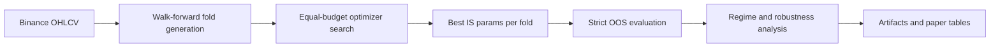

# qa-param-search

Quantum Annealing-Based Parameter Search for Rule-Based Crypto Trading:
Robustness Under Non-Stationarity

> EMA-RSI-ATR 규칙 전략에서 Quantum Annealing 기반 파라미터 탐색이
> 비정상 암호화폐 시장에서 더 강건한 OOS 일반화를 보이는지 평가하는 연구 하네스입니다.

이 저장소의 초점은 단순 수익률 극대화가 아닙니다. 핵심 질문은 walk-forward 재최적화 환경에서
IS에서 찾은 파라미터가 OOS 구간으로 얼마나 일반화되는지, 그리고 그 선택점이 얼마나 안정적인지입니다.

## At A Glance

| 항목 | 내용 |
| --- | --- |
| 연구 주제 | Non-stationary crypto market에서의 parameter search robustness |
| 전략 | EMA-RSI-ATR 규칙 기반 long/short 전략 |
| 비교군 | Grid, Random, TPE, Classical SA, Quantum Annealing |
| 데이터 | Binance Futures BTCUSDT / ETHUSDT / SOLUSDT × 30m / 1h |
| 평가 방식 | Walk-forward optimization + strict OOS + regime-conditional analysis |
| 핵심 지표 | Median OOS Sharpe, IS-OOS decay, parameter stability, CSCV PBO |
| 현재 QA 구현 | `neal` 기반 simulated quantum annealing |
| 저장소 성격 | 논문용 오프라인 research harness |

## Why This Project

규칙 기반 전략 파라미터 탐색은 비정상 시계열에서 쉽게 과최적화됩니다.
이 프로젝트는 "QA가 더 높은 IS 점수를 찾는가"보다,
"QA가 구조 변화 이후에도 덜 무너지는 파라미터를 찾는가"를 검증하는 데 초점을 둡니다.

## 현재 연구 질문

**RQ**: 비정상적이고 구조 변화가 심한 암호화폐 시장에서, QUBO 인코딩 기반 양자 어닐링
파라미터 탐색이 고전적 탐색 방법 대비 walk-forward re-optimization 하에서
더 강건한 OOS 일반화를 달성하는가?

### Hypotheses

- **H1 Generalization**: QA는 fold 전반에서 IS→OOS performance decay가 더 작다.
- **H2 Parameter Stability**: QA는 fold 간 parameter dispersion이 더 낮고 perturbation sensitivity가 더 작다.
- **H3 Regime Dependence**: QA의 상대적 이점은 high-volatility regime에서 더 두드러진다.

## 현재 논문 방향

| 관점 | 현재 강조점 |
| --- | --- |
| 핵심 서사 | 수익률 우위보다 OOS 강건성과 일반화 비교 |
| 1차 증거 | Median OOS Sharpe, IS→OOS decay |
| 2차 증거 | Parameter dispersion, local robustness, IS-OOS correlation |
| 구조적 증거 | Regime analysis, landscape shift, convergence trace, CSCV PBO |
| 외부 타당성 | 다자산 × 다타임프레임 consistency |

## 실험 설계

| 항목 | 설정 |
| --- | --- |
| 전략 | EMA-RSI-ATR 고정 규칙 전략 |
| 자산/타임프레임 | BTCUSDT, ETHUSDT, SOLUSDT × 30m, 1h |
| Walk-forward | IS 18개월 / OOS 3개월 / step 3개월 |
| 검증 원칙 | OOS는 탐색 과정에 절대 노출되지 않음 |
| 비교군 | Grid, Random, TPE, Classical Simulated Annealing, Quantum Annealing |
| 공정성 | 동일 evaluation budget, 동일 seed, 동일 split, 동일 비용 가정 |

## 분석 프레임

| 축 | 무엇을 보는가 |
| --- | --- |
| 일반화 | Median OOS Sharpe, IS-OOS decay, IS-OOS correlation |
| 안정성 | Parameter dispersion, one-step perturbation 기반 local robustness |
| 국면 분석 | Rolling volatility quantile 기반 high / medium / low regime |
| 구조 분석 | Optimization landscape shift, optimizer convergence trace |
| 과최적화 통제 | CSCV PBO, Cliff's delta, Holm-Bonferroni correction |
| 현실성 점검 | Cost sensitivity, execution delay sensitivity, funding post-hoc impact |
| 추가 실험 | QA / SA ablation study |

## Workflow



## 구현 상태

현재 코드베이스는 다음 흐름을 지원합니다.

- 데이터 로드 및 Binance OHLCV 다운로드
- 결정론적 백테스트와 거래비용 반영
- 5개 optimizer의 동일 예산 비교
- Fold별 OOS 평가와 artifact 저장
- Regime labeling, convergence, landscape, CSCV PBO 분석
- QA / SA ablation 실행
- Cost, delay, funding 민감도 분석

결과 아티팩트는 `research/artifacts/`에 저장됩니다.

## Repository Guide

### 핵심 문서

- [CLAUDE.md](CLAUDE.md): 프로젝트 기준 문서와 전체 연구 구조 요약
- [PAPER_SCOPE.md](PAPER_SCOPE.md): 최신 연구 질문, 가설, 포함/제외 범위
- [EXPERIMENT_PROTOCOL.md](EXPERIMENT_PROTOCOL.md): 데이터, walk-forward, 공정성, 통계, sensitivity 프로토콜
- [MANUSCRIPT_OUTLINE.md](MANUSCRIPT_OUTLINE.md): 원고 구조, 표/그림 계획, 작성 순서

### 핵심 코드

- `research/run_experiment.py`: 메인 walk-forward 실험 실행기
- `research/run_ablation.py`: QA / SA ablation 실행기
- `research/optimizers/`: 비교 optimizer 구현
- `research/evaluation/`: 일반화, 안정성, 국면, 과최적화 분석 모듈
- `research/backtest/`: 백테스트 엔진, 비용, funding, delay 분석 모듈

## 빠른 시작

```bash
# 1. 의존성 설치
pip install -r requirements.txt

# 2. 데이터 다운로드 예시
python research/data/downloader.py --symbol BTCUSDT --timeframe 30m

# 3. 메인 실험 실행
python research/run_experiment.py

# 4. Ablation 실행
python research/run_ablation.py
```

## 산출물

실험이 끝나면 `research/artifacts/`에 아래와 같은 정보가 저장됩니다.

- Fold별 best parameters
- Fold별 IS / OOS metrics
- Optimizer별 summary statistics
- Regime labels와 robustness diagnostics
- Statistical comparison results
- Ablation artifacts

## 범위 밖

- 실제 D-Wave QPU 또는 hybrid solver 기반 실험
- QAOA 비교
- 딥러닝 예측 모델 결합
- 멀티에이전트 거래 시스템 아키텍처
- 실시간 실행 엔진 성능 자체를 논문 기여로 주장하는 것

현재 Quantum Annealing 구현은 `neal` 기반 simulated quantum annealing입니다.
즉, 이 저장소는 실제 hardware quantum advantage를 입증하는 프로젝트가 아니라,
비정상 시계열 하에서의 조합최적화 기반 파라미터 탐색 강건성을 비교하는 연구 하네스입니다.

## 주의사항

- 이 저장소는 연구 평가용이며 실거래 운용 시스템이 아닙니다.
- 모든 결과는 동일 분할, 동일 예산, 동일 비용 가정 하에서 재현 가능해야 합니다.
- funding rate는 현재 메인 objective가 아니라 post-hoc sensitivity/discussion 항목입니다.
- 실제 GitHub 공개용 문서 기준으로는 [PAPER_SCOPE.md](PAPER_SCOPE.md)와 [EXPERIMENT_PROTOCOL.md](EXPERIMENT_PROTOCOL.md)를 함께 읽어야 전체 설계를 이해할 수 있습니다.
